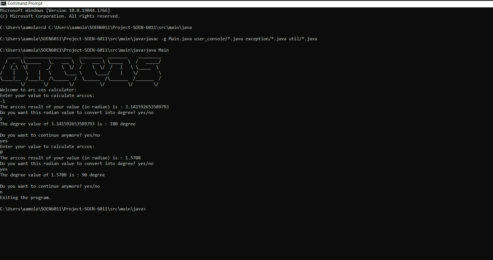
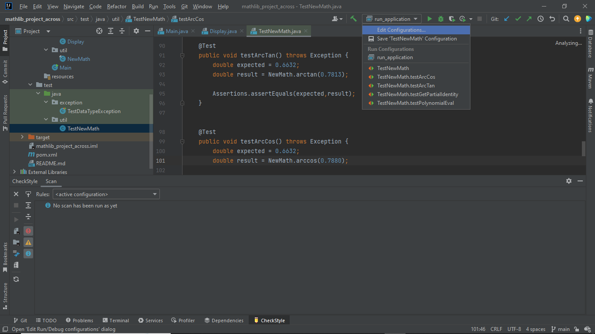
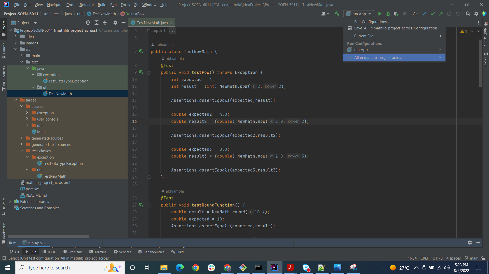
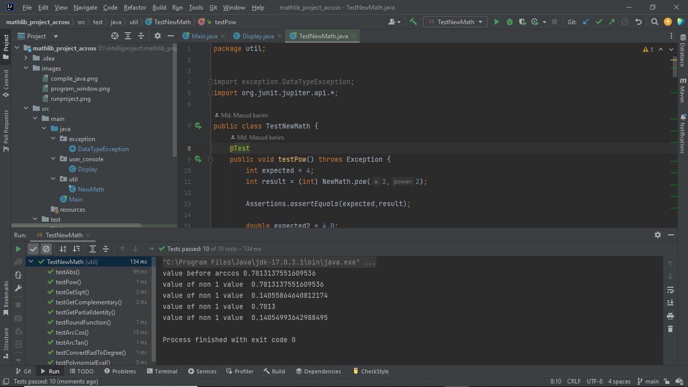
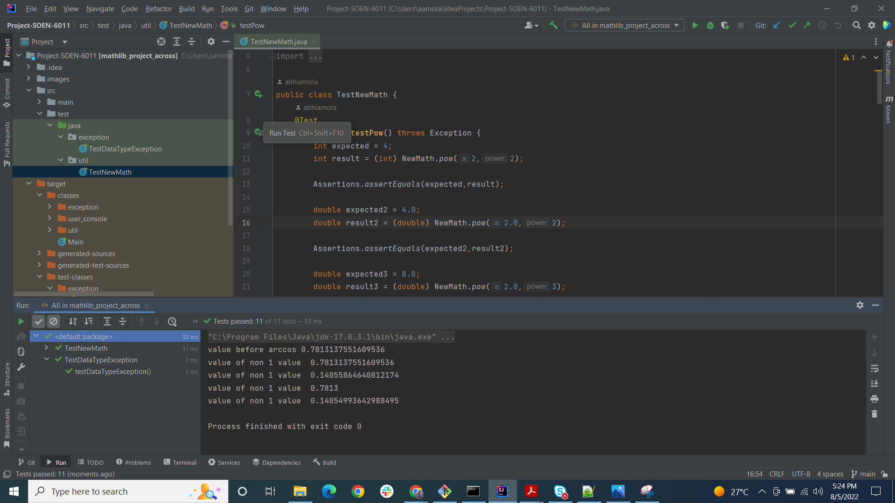

# Arccos calculator
***Welcome to arccos calcualtor reporsitory.***
***
To compile this code type the following commnad
at first you need to navigate to the source code using the folloowing command 
```
cd Arcos-Calculator\src\main\java
```
after the type the below command to get the compiled code
```
javac -g Main.java user_console/*.java exception/*.java util/*.java
```

To run the code above compiled program type the command below:

```
java Main
```

After running the command this window will show


### To test the code the following steps are usefull
There are several ways of testing the code :
- Click on the top right corner and click on the dropdown
like the below image

- In the dropdown menu there will be several options for test
the first option will test every methods in the class

- After clicking the option the test will start to perform
like the below image


There is another way of achieving the same thing
from the below image there is a green button beside the line number
click that button to perform the test.

